# Splunk Lab for Phishing Campaigns

This repository documents my cybersecurity home lab designed to detect and analyze phishing campaigns using Splunk and Snort. The lab demonstrates how to:

Ingest labeled email datasets into Splunk to track phishing campaigns.

Analyze user behavior, such as clicks on phishing links, and extract email header information for threat intelligence.

Integrate Snort IDS with Splunk to simulate interactions with phishing emails and monitor suspicious activity in real time.

## Installing Splunk Enterprise and Splunk UniversalForwarder

To begin, I installed the latest versions of both Splunk Enterprise and their Universal Forwader. I made sure to download the 64-bit Windows package for both.

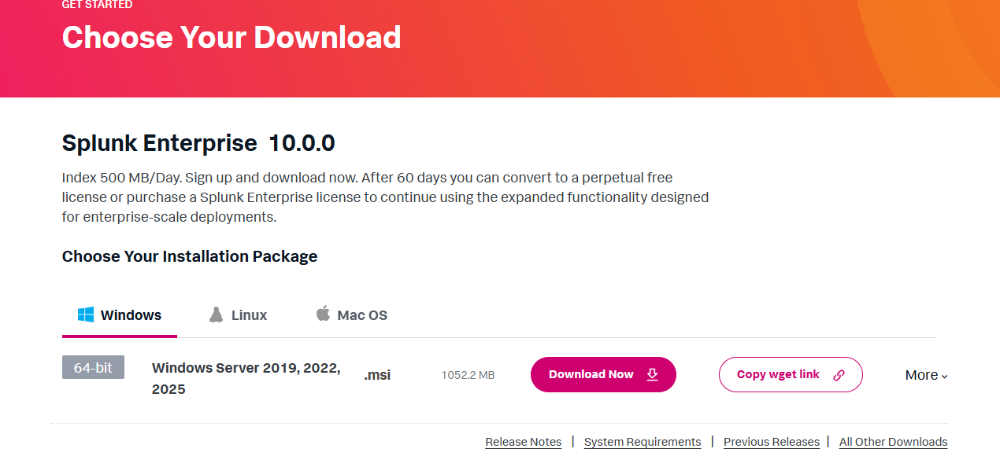

## Configuring the Forwader

After running the installer and choosing the default install path, I now need to configure the forwarder to recieve and deploy on my lab's server IP. Thankfully, Splunk makes this easy by just filling in the host and already having the port numbers available.

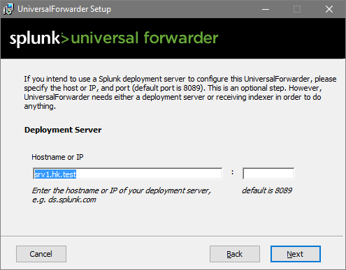
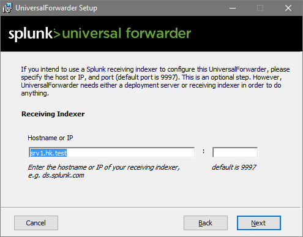

## PHISHING DATASET INGESTION: CEAS_08.csv & TREC_06.csv 

I found this dataset online that had **TONS** of phishing emails and decided to use it. I downloaded it and quickly needed to make the Universal Forwarder monitor this file specifically so it could be ingested into Splunk. 

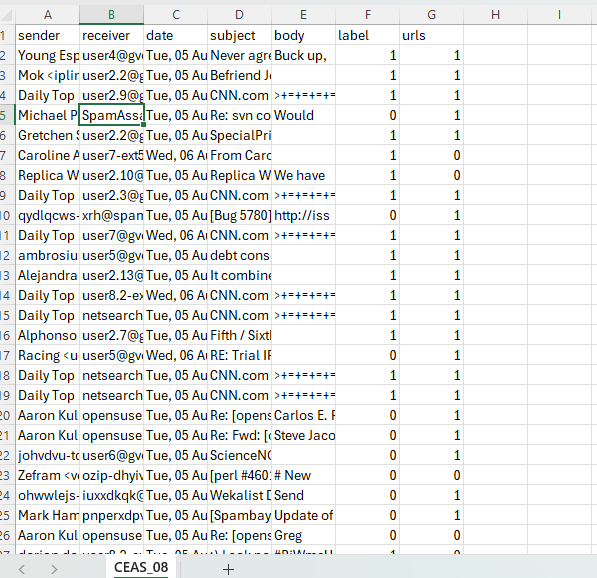

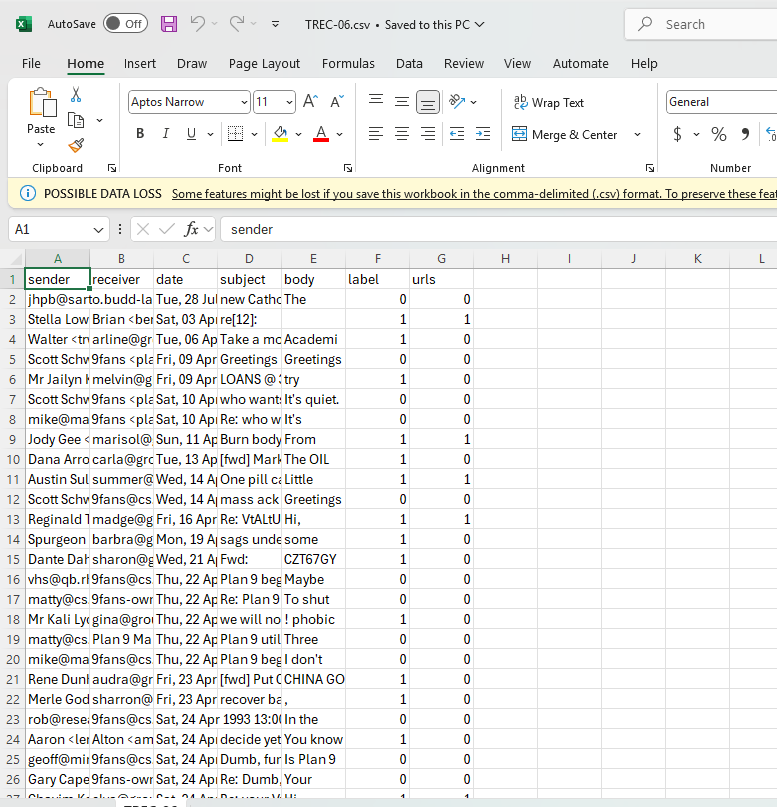

## Inputs.conf & Outputs.conf

To ensure the phishing dataset is ingested correctly, I configured two main files in the Universal Forwarder: inputs.conf and outputs.conf. In the inputs CONF file, I specificed that the forwarder should monitor the CEAS08 CSV file. I also set the index to phishing so that all records would be stored in the correct location within Splunk. I made sure to define the source type as csv so the data would be parsed appropriately.

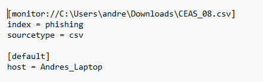

In outputs.conf, I configured where the monitored data should go. This involved specifying the recieving Splunk Enterprise instance and the port **127.0.0.1:9997** to forward the logs. By setting up both of these files, the Universal Forwarder monitors the phishing CSV and reliably forwards the data to my Splunk server.

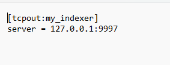

## Bringing the Data to Splunk

After refreshing the UniversalForwader, I finally can now go to my Splunk Enterprise server. Signed in using the username and password that I created during the installation process.

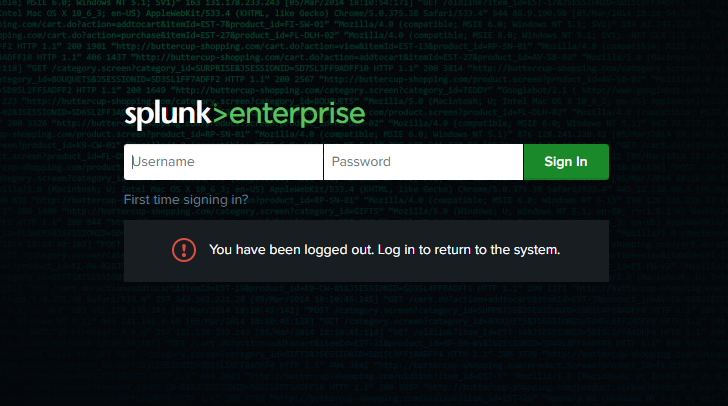

Once signed in, I need to make it to where Splunk is recieving data from the same port number as my indexer **9997**. To do this, I went Settings --> Forwarding and Receiving --> Configure recieving and added 9997. 

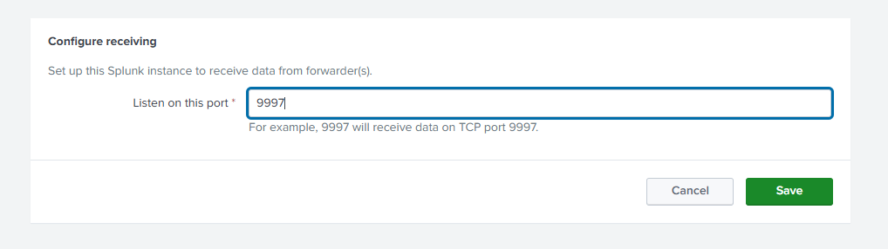

Now, all I have to do is create the index I mentioned in my **inputs.conf** file. To do this, I went to Settings --> Indexes --> New Index and named it **phishing** while keeping everything else default.

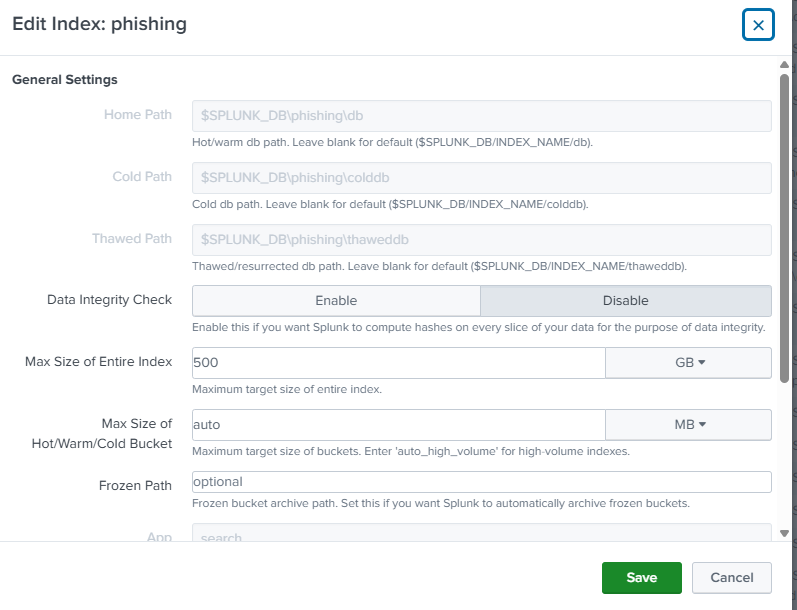

I can now search through the ingested logs by typing index=phishing into the Search in **Search and Reporting** and set the time to **All Time** to ensure all logs are shown. After a few minutes, we are left with over **55000** events! 

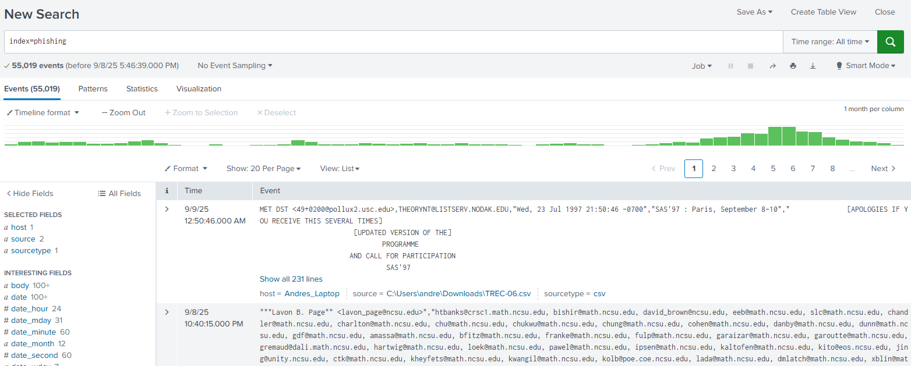

## Reviewing Logs & Extract Email Headers for Threat Intelligence

With all of these events, I need to create a query that can simplify the logs into meaningful threat intelligence. Since the dataset already provides fields like sender, receiver, subject, date, URLs, and labels, I can treat them like real email headers and extract useful insights. For example, analyzing the sender field highlights which accounts or domains are most commonly associated with phishing attempts. The first was making the label = 1, 1 meaning that the email is malicious.

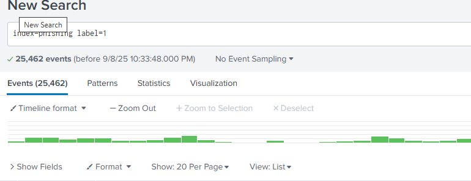

This simple query managed to cut our events in half and shows the true amount of 25,462 **phishing** emails. I can now dive into certain emails and investigate for each phishing campaign. 

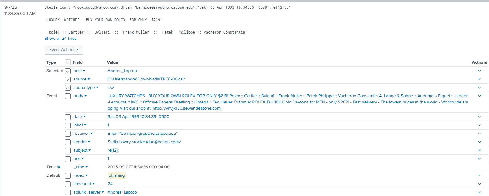

