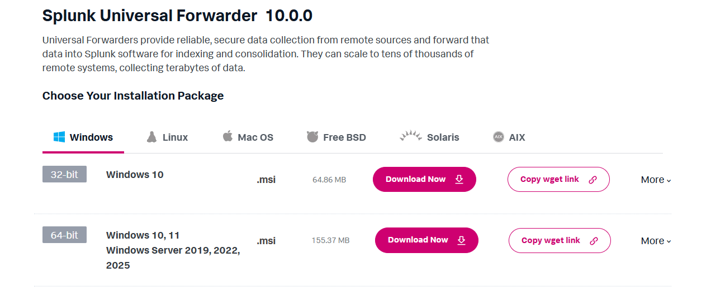

# Splunk Lab for Phishing Campaigns

This repository documents my cybersecurity home lab designed to detect and analyze phishing campaigns using Splunk and Snort. The lab demonstrates how to:

Ingest labeled email datasets into Splunk to track phishing campaigns.

Analyze user behavior, such as clicks on phishing links, and extract email header information for threat intelligence.

Integrate Snort IDS with Splunk to simulate interactions with phishing emails and monitor suspicious activity in real time.

## Installing Splunk Enterprise and Splunk UniversalForwarder

To begin, I installed the latest versions of both Splunk Enterprise and their Universal Forwader. I made sure to download the 64-bit Windows package for both.

## Configuring the Forwader

After running the installer and choosing the default install path, I now need to configure the forwarder to recieve and deploy on my lab's server IP. Thankfully, Splunk makes this easy by just filling in the host and already having the port numbers available.

## PHISHING DATASET INGESTION: CEAS_08.csv

I found this dataset online that had **TONS** of phishing emails and decided to use it. I downloaded it and quickly needed to make the Universal Forwarder monitor this file specifically so it could be ingested into Splunk. 

## Inputs.conf & Outputs.conf

To ensure the phishing dataset is ingested correctly, I configured two main files in the Universal Forwarder: inputs.conf and outputs.conf. In the inputs CONF file, I specificed that the forwarder should monitor the CEAS08 CSV file. I also set the index to phishing so that all records would be stored in the correct location within Splunk. I made sure to define the source type as csv so the data would be parsed appropriately.

In outputs.conf, I configured where the monitored data should go. This involved specifying the recieving Splunk Enterprise instance and the port **127.0.0.1:997** to forward the logs. By setting up both of these files, the Universal Forwarder monitors the phishing CSV and reliably forwards the data to my Splunk server.

